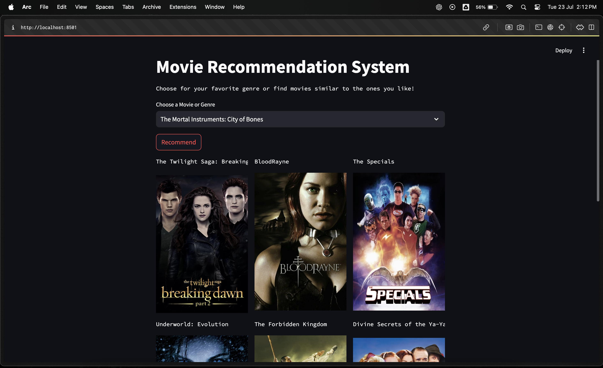

# Movie Recommender System

A simple and user-friendly system deployed using Streamlit. This project uses TMDB's dataset containing data of about 5000 movies, encompassing a variety of genres. This tool offers a delightful and seamless experience for movie enthusiasts. Whether you’re in the mood to explore new genres or find films similar to your favorites, we’ve got you covered.

## Prerequisites

- Python 3.x
- Streamlit
- Pandas
- Requests
- Joblib

## Installation

1. **Clone the Repository:**
   - Clone the repository to your local machine 
    

2. **Install Dependencies:**
   - Install the necessary Python packages using the `requirements.txt` file:
     ```bash
     pip install -r requirements.txt
     ```

## Usage

1. **Run the Notebook:**
   - The repository already contains the necessary CSV files (`tmdb_5000_movies.csv` and `tmdb_5000_credits.csv`), as well as the pre-trained models (`movies.pkl` and `similarity.pkl`). 
   - If you need to re-generate the `movies.pkl` and `similarity.pkl` files, open and run the `Movie Recommender.ipynb` notebook. This will process the CSV files and save the required pickle files in your project directory.

2. **Run app.py:**
   - Use the following command to start the Streamlit server on your localhost:
     ```bash
     streamlit run app.py
     ```
   - This will launch the web application, and you can access it in your web browser at `http://localhost:8501`.

## Images
### Main Page



